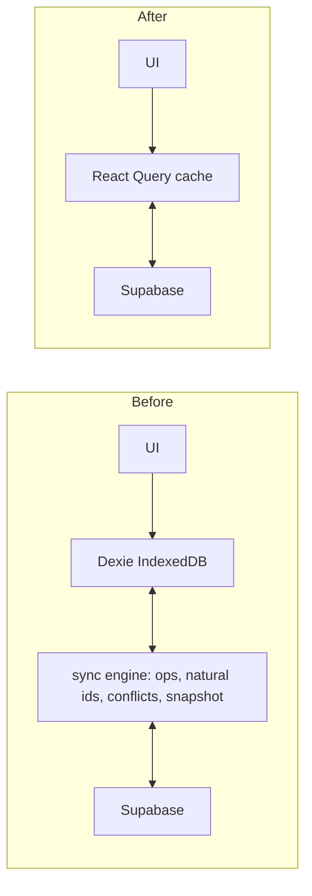

# Online-only rewrite: Supabase as single source of truth

## Phase 0: stop the bleeding (do this first, today)

[#58](https://github.com/andre-koga/upwards/pull/58) is merged and live, and it is still destroying data on every device that updates. It bumped the bootstrap flag, which forces `bootstrapProtocolV2` to re-run, which calls `applySyncSnapshot`, which hard-deletes local untimed rows and overwrites `daily_entries` counts with the server's.

- Revert the `PROTOCOL_V2_KEY` rename in [app/src/lib/sync/sync-storage.ts](app/src/lib/sync/sync-storage.ts) back to `okhabit_sync_protocol_v2` so devices stop re-bootstrapping.
- Close [#59](https://github.com/andre-koga/upwards/pull/59) unmerged. The restore button is the same landmine on a button.
- Do not run any further snapshot applies until Phase 1 is done.

This is a ~2 line diff and it is the only urgent item.

## Phase 1: ground truth (blocked on Supabase access)

The MCP still only sees `demo-db`, `core-db`, `dev-db`. Cursor likely needs a reload to pick up the new account. Read-only `SELECT`s only:

- `journal_entries`: total, `deleted_at IS NOT NULL`, and rows where `text_content` is empty and there is no `title` / `day_emoji` / `photo_paths` / `video_path` / `location`. That last bucket is "restored but invisible", since `journalEntryHasContent` hides it.
- `daily_entries`: counts per activity for the affected recent dates. This is the real fact behind the untimed timeline entries.
- `sync_operations`: journal and daily-entry payloads still holding text/counts the tables lost. This is the recovery source.

I will not write a line of migration code before reading these. I have been wrong three times inferring from code.

## Phase 2: recover, then rescue local-only data

- Recover journal text and `daily_entries` counts from `sync_operations` payloads where the table lost them.
- Before Dexie is removed, export each device with the existing backup feature ([app/src/components/settings/use-data-backup.ts](app/src/components/settings/use-data-backup.ts)) and upload anything local-only. From the code, local-only reduces to: rows in `syncPendingOperations`, rows the sanitizers rejected (recorded in `syncIssues`), and `activityStreaks`, which is in `SYNC_TABLES` but not `SNAPSHOT_TABLES` so it is pushed and never pulled. Streaks are derived and recomputable.
- `activityDefinitionVersions` and `groupDefinitionVersions` are local-only and already forbidden by the architecture doc. Drop them.

## Phase 3: the rewrite

Scope, measured: 58 files import `@/lib/db`, 44 import `@/lib/sync`, ~150 direct `db.<table>` call sites. Deleting `lib/sync` removes 5,692 source lines plus 2,735 test lines. Media already lives in Supabase Storage ([app/src/lib/journal/photo-storage.ts](app/src/lib/journal/photo-storage.ts)), so there is no blob migration.

- Add `@tanstack/react-query`. It is a new dependency, but it replaces far more than it adds: it removes Dexie plus the entire sync layer, and it is what keeps taps feeling instant via optimistic updates. Hand-rolling loading/error/dedup across 150 call sites is the worse option.
- Build one thin query/mutation module per table, reading and writing through `supabase-js` with RLS. Invalidate on mutate.
- Migrate feature by feature (activities, daily entries, tasks, memos, journal), each landing independently. Every screen that currently reads Dexie synchronously needs real loading and error states.
- Multi-device becomes a Supabase Realtime subscription that invalidates query keys. No merge, no conflict resolution.
- Collapse untimed completions to one representation. The code already decided they are derived from `count >= target` and must never be stored ([app/src/lib/sync/mutate-synced.ts](app/src/lib/sync/mutate-synced.ts)); delete `buildUntimedPeriod`, `dropLocalUntimedPeriods`, the snapshot filter, and the stored-row concept entirely. Three disagreeing representations is the actual root cause of this whole saga.
- Delete `lib/sync`, `lib/db`, the Sync issues page, conflict review UI, and the `dexie` dependency last, once nothing imports them.

## Phase 4: update the binding docs (required, not optional)

`AGENTS.md` requires calling out contradictions with the architecture records and updating them deliberately. This plan contradicts both:

- [docs/architecture/temporal-data-sync.md](docs/architecture/temporal-data-sync.md) mandates Dexie, offline behavior, idempotent ops, and in-app conflict review. Online-only removes all four.
- [docs/architecture/ui-system-and-responsive-layout.md](docs/architecture/ui-system-and-responsive-layout.md) requires preserving the mobile-first PWA experience.

Both need rewriting to record the new tradeoff: multi-device correctness and ~8.4k fewer lines, paid for with a hard network dependency.

## The cost, stated plainly

The app stops working without a connection. For a habit tracker you open on the subway, that is a real regression, and `vite-plugin-pwa` currently ships an offline shell that will now be a shell around an app that cannot load data. You chose this knowingly; I am recording it so it is not a surprise later.